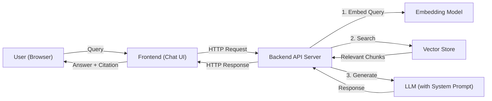
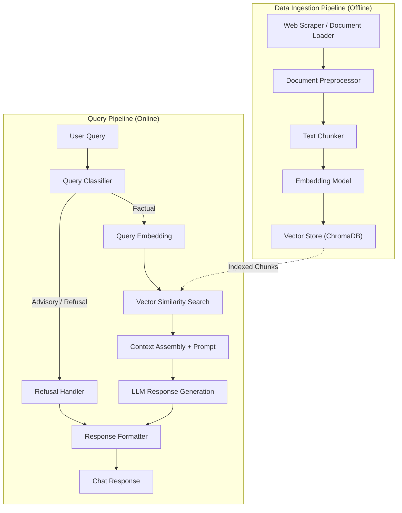
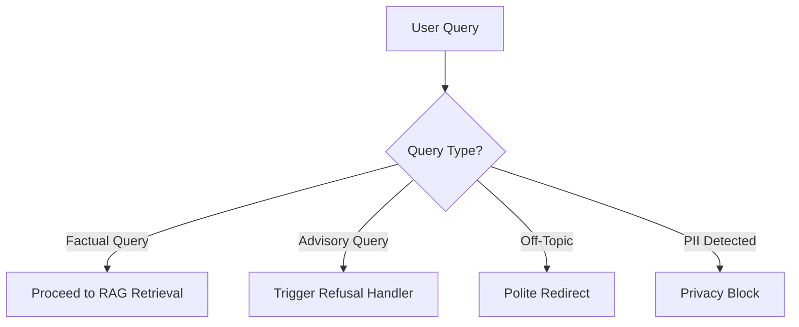
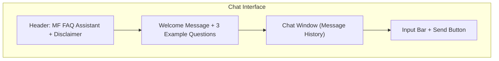
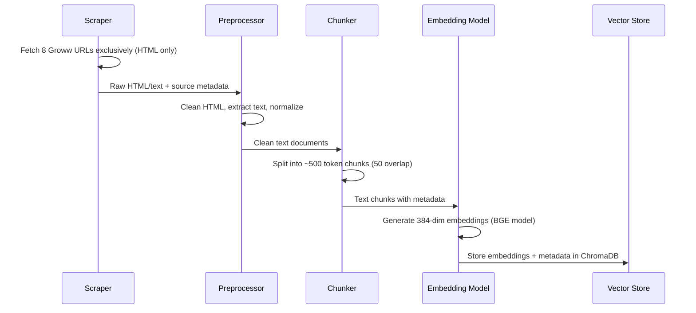
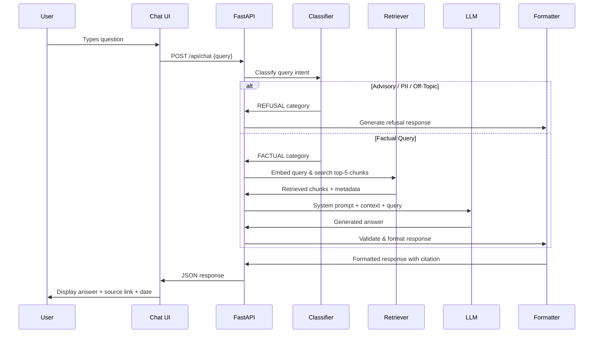

# Architecture: Mutual Fund FAQ Assistant (RAG Chatbot)

## 1. System Overview

The Mutual Fund FAQ Assistant is a **Retrieval-Augmented Generation (RAG)** chatbot that answers factual queries about ICICI Prudential mutual fund schemes. It retrieves information from a curated corpus of official sources and generates concise, source-backed responses using an LLM.



### Design Principles

| Principle | Description |
|-----------|-------------|
| **Facts-Only** | No opinions, advice, or recommendations — only verifiable data |
| **Source-Backed** | Every response includes exactly one citation link |
| **Transparent** | Responses include a "Last updated from sources" footer |
| **Privacy-First** | No PII collection (PAN, Aadhaar, phone, email) |
| **Minimal & Focused** | Max 3-sentence responses; clean, simple UI |

---

## 2. High-Level Architecture



The system is split into two major pipelines:

1. **Data Ingestion Pipeline (Offline):** Scrapes, processes, chunks, embeds, and indexes official mutual fund data.
2. **Query Pipeline (Online):** Classifies user queries, retrieves relevant context, generates factual answers, and formats responses with citations.

---

## 3. Component Deep Dive

### 3.1 Data Ingestion Pipeline

#### 3.1.1 Web Scraper / Document Loader

| Property | Detail |
|----------|--------|
| **Purpose** | Fetch content from the 8 Groww scheme pages and supplementary official sources |
| **Input** | URLs from corpus definition (see [context.md](file:///c:/Users/tanis/rag%20chatbot%20NextLeap/docs/context.md)) |
| **Output** | Raw HTML/text content with source metadata |
| **Tools** | `BeautifulSoup4`, `requests`, or `LangChain WebBaseLoader` |

**Source URLs (Primary Corpus):**

| # | Scheme | URL |
|---|--------|-----|
| 1 | Large Cap Fund | `groww.in/mutual-funds/icici-prudential-large-cap-fund-direct-growth` |
| 2 | Flexicap Fund | `groww.in/mutual-funds/icici-prudential-flexicap-fund-direct-growth` |
| 3 | Technology Fund | `groww.in/mutual-funds/icici-prudential-technology-fund-direct-growth` |
| 4 | Infrastructure Fund | `groww.in/mutualfunds/icici-prudential-infrastructure-fund-direct-growth` |
| 5 | Dynamic Plan | `groww.in/mutual-funds/icici-prudential-dynamic-plan-direct-growth` |
| 6 | Nifty Next 50 Index Fund | `groww.in/mutual-funds/icici-prudential-nifty-next-50-index-fund-direct-growth` |
| 7 | Bharat 22 FOF | `groww.in/mutual-funds/icici-prudential-bharat-22-fof-direct-growth` |
| 8 | Silver ETF FOF | `groww.in/mutual-funds/icici-prudential-silver-etf-fof-direct-growth` |

**Constraints:** Only the HTML content from these 8 URLs will be scraped. No PDFs or other external websites are included in the corpus.

#### 3.1.2 Document Preprocessor

| Property | Detail |
|----------|--------|
| **Purpose** | Clean and normalize raw content |
| **Operations** | Strip HTML tags, remove navigation/boilerplate, normalize whitespace, extract structured fields |
| **Metadata Attached** | `source_url`, `scheme_name`, `category`, `document_type`, `scrape_date` |

#### 3.1.3 Text Chunker

| Property | Detail |
|----------|--------|
| **Purpose** | Split documents into semantically meaningful, retrieval-friendly chunks |
| **Strategy** | `RecursiveCharacterTextSplitter` (LangChain) |
| **Chunk Size** | ~500 tokens |
| **Chunk Overlap** | ~50 tokens |
| **Metadata Preserved** | Each chunk retains `source_url`, `scheme_name`, `section_heading` |

> [!TIP]
> Chunk boundaries should respect section headings where possible (e.g., "Expense Ratio", "Exit Load") to keep related facts together.

#### 3.1.4 Embedding Model

| Property | Detail |
|----------|--------|
| **Purpose** | Convert text chunks into dense vector representations |
| **Model** | `BAAI/bge-small-en-v1.5` (384 dimensions) via `sentence-transformers` |
| **Rationale** | Open-source, high-quality embeddings, strong retrieval performance on MTEB benchmarks, free to run locally |

#### 3.1.5 Vector Store

| Property | Detail |
|----------|--------|
| **Purpose** | Store and index embeddings for fast similarity search |
| **Engine** | **ChromaDB** (local, file-persisted) |
| **Collection** | `icici_prudential_mf_corpus` |
| **Metadata Filtering** | Support filtering by `scheme_name`, `category`, `document_type` |

---

### 3.2 Query Pipeline

#### 3.2.1 Query Classifier



| Property | Detail |
|----------|--------|
| **Purpose** | Classify incoming queries before processing |
| **Method** | LLM-based classification via system prompt or lightweight keyword/intent classifier |
| **Categories** | `FACTUAL`, `ADVISORY`, `OFF_TOPIC`, `PII_DETECTED` |

**Advisory detection keywords/patterns:**
- "should I", "which is better", "recommend", "suggest", "worth investing", "good fund", "best fund"
- Comparative queries: "X vs Y", "compare", "better returns"

**PII detection patterns:**
- PAN format (`[A-Z]{5}[0-9]{4}[A-Z]`)
- Aadhaar format (12-digit number)
- Phone/email patterns

#### 3.2.2 Vector Similarity Search (Retriever)

| Property | Detail |
|----------|--------|
| **Purpose** | Find the most relevant document chunks for a given query |
| **Method** | Cosine similarity search in ChromaDB |
| **Top-K** | Retrieve top **3–5 chunks** |
| **Metadata Filter** | Optionally filter by scheme name if detected in query |
| **Re-ranking** | Optional cross-encoder re-ranking for improved precision |

#### 3.2.3 Context Assembly & Prompt Engineering

The retrieved chunks are assembled into a structured prompt sent to the LLM.

**System Prompt Template:**

```
You are a facts-only mutual fund FAQ assistant for ICICI Prudential schemes.

RULES:
1. Answer ONLY using the provided context. Do NOT use external knowledge.
2. Limit responses to a MAXIMUM of 3 sentences.
3. Include EXACTLY ONE source citation link in your response.
4. End every response with: "Last updated from sources: <date>"
5. NEVER provide investment advice, opinions, or recommendations.
6. NEVER compare fund performance or calculate returns.
7. If the question is advisory, refuse politely and provide an educational link.
8. If the answer is not in the context, say "I don't have this information in my sources."

CONTEXT:
{retrieved_chunks}

USER QUESTION:
{user_query}
```

#### 3.2.4 LLM (Response Generator)

| Property | Detail |
|----------|--------|
| **Purpose** | Generate a concise, factual answer from retrieved context |
| **Provider** | **Groq** (ultra-fast inference) |
| **Model** | `llama-3.3-70b-versatile` |
| **Temperature** | `0.0` — deterministic, factual responses |
| **Max Tokens** | `200` — enforces brevity |
| **Guardrails** | System prompt + post-processing validation |

#### 3.2.5 Refusal Handler

| Trigger | Response |
|---------|----------|
| Advisory query | "I'm a facts-only assistant and cannot provide investment advice. For guidance, visit [AMFI](https://www.amfiindia.com/) or consult a SEBI-registered advisor." |
| Performance comparison | "I cannot compare fund performance. You can view the official factsheet at [source link]." |
| PII detected | "For your security, please do not share personal information like PAN, Aadhaar, or account numbers here." |
| Off-topic | "I can only answer factual questions about ICICI Prudential mutual fund schemes." |

#### 3.2.6 Response Formatter

Every response is post-processed to ensure compliance:

```
┌─────────────────────────────────────────────────┐
│  Answer (max 3 sentences)                       │
│                                                 │
│  Source: <single citation URL>                  │
│  Last updated from sources: <YYYY-MM-DD>        │
└─────────────────────────────────────────────────┘
```

**Validation checks:**
- ✅ Response ≤ 3 sentences
- ✅ Exactly 1 citation link present
- ✅ Footer with last updated date present
- ✅ No advisory language detected
- ✅ No PII in response

---

## 4. Frontend Architecture

### 4.1 Chat UI Design



| Property | Detail |
|----------|--------|
| **Framework** | HTML + Vanilla CSS + JavaScript (or React if needed) |
| **Layout** | Single-page chat interface |
| **Theme** | Clean, minimal, Groww-inspired color palette |

### 4.2 UI Components

| Component | Description |
|-----------|-------------|
| **Header** | App title + persistent disclaimer banner: `"Facts-only. No investment advice."` |
| **Welcome Screen** | Greeting message + 3 clickable example questions |
| **Chat Bubbles** | User messages (right-aligned) and bot responses (left-aligned) with citation links |
| **Input Bar** | Text input with send button; no file upload or attachment |
| **Source Badge** | Clickable source link displayed below each bot response |
| **Loading State** | Typing indicator while awaiting response |

### 4.3 Example Questions (Welcome Screen)

1. *"What is the expense ratio of ICICI Prudential Large Cap Fund?"*
2. *"What is the exit load for ICICI Prudential Flexicap Fund?"*
3. *"What is the minimum SIP amount for ICICI Prudential Technology Fund?"*

---

## 5. Tech Stack

| Layer | Technology | Rationale |
|-------|------------|-----------|
| **Frontend** | HTML / CSS / JavaScript | Simple, no build step, easy to deploy |
| **Backend** | Python + FastAPI | Lightweight, async, great for API serving |
| **Embedding Model** | `BAAI/bge-small-en-v1.5` | Open-source, strong retrieval performance, runs locally |
| **Vector Store** | ChromaDB | Local, file-persisted, no infra overhead |
| **LLM** | Groq (`llama-3.3-70b-versatile`) | Ultra-fast inference, free tier available, great instruction following |
| **Orchestration** | LangChain | Simplifies RAG pipeline (loaders, splitters, retrievers, chains) |
| **Web Scraping** | BeautifulSoup4 + requests | Standard, reliable HTML parsing |
| **Environment** | Python 3.11+, venv | Reproducible local setup |

---

## 6. Project Structure

```
rag-chatbot-nextleap/
├── docs/
│   ├── problemstatement.txt        # Original problem statement
│   ├── context.md                  # Product context & corpus definition
│   └── architecture.md             # This document
├── data/
│   ├── raw/                        # Raw scraped HTML/text files
│   ├── processed/                  # Cleaned and chunked documents
│   └── urls.json                   # Corpus URL registry with metadata
├── src/
│   ├── ingestion/
│   │   ├── scraper.py              # Web scraper for Groww & AMC pages
│   │   ├── preprocessor.py         # Document cleaning & normalization
│   │   ├── chunker.py              # Text splitting with metadata
│   │   └── indexer.py              # Embedding + ChromaDB indexing
│   ├── query/
│   │   ├── classifier.py           # Query intent classification
│   │   ├── retriever.py            # Vector similarity search
│   │   ├── generator.py            # LLM response generation
│   │   ├── refusal.py              # Refusal/guardrail handler
│   │   └── formatter.py            # Response post-processing
│   ├── api/
│   │   ├── main.py                 # FastAPI application entry point
│   │   ├── routes.py               # API route definitions
│   │   └── models.py               # Pydantic request/response schemas
│   └── config.py                   # Environment variables & settings
├── frontend/
│   ├── index.html                  # Chat UI page
│   ├── style.css                   # Styling
│   └── app.js                      # Chat logic & API calls
├── vectorstore/                    # ChromaDB persisted data (gitignored)
├── tests/
│   ├── test_classifier.py          # Query classification tests
│   ├── test_retriever.py           # Retrieval accuracy tests
│   ├── test_refusal.py             # Refusal handling tests
│   └── test_formatter.py           # Response format validation
├── .env                            # API keys (gitignored)
├── .gitignore
├── requirements.txt                # Python dependencies
└── README.md                       # Setup & usage instructions
```

---

## 7. Data Flow (End-to-End)

### 7.1 Ingestion Flow



### 7.2 Query Flow



---

## 8. API Design

### 8.1 Endpoints

| Method | Endpoint | Description |
|--------|----------|-------------|
| `POST` | `/api/chat` | Submit a user query and receive an answer |
| `GET` | `/api/health` | Health check endpoint |
| `GET` | `/api/schemes` | List available scheme names |

### 8.2 Request / Response Schema

**POST `/api/chat`**

Request:
```json
{
  "query": "What is the expense ratio of ICICI Prudential Large Cap Fund?"
}
```

Response (Factual):
```json
{
  "answer": "The expense ratio of ICICI Prudential Large Cap Fund (Direct Growth) is 1.05%.",
  "source_url": "https://groww.in/mutual-funds/icici-prudential-large-cap-fund-direct-growth",
  "last_updated": "2026-07-01",
  "type": "factual"
}
```

Response (Refusal):
```json
{
  "answer": "I'm a facts-only assistant and cannot provide investment advice. For guidance, visit AMFI (https://www.amfiindia.com/) or consult a SEBI-registered advisor.",
  "source_url": "https://www.amfiindia.com/investor-corner/knowledge-center",
  "last_updated": "2026-07-01",
  "type": "refusal"
}
```

---

## 9. Guardrails & Compliance

### 9.1 Input Guardrails

| Check | Action |
|-------|--------|
| Advisory language detected | Return refusal response |
| PII patterns detected | Block and warn user |
| Query too long (>500 chars) | Truncate or reject |
| Empty query | Prompt user to ask a question |

### 9.2 Output Guardrails

| Check | Action |
|-------|--------|
| Response > 3 sentences | Truncate to 3 sentences |
| Missing citation link | Append source from retrieved chunk metadata |
| Missing "Last updated" footer | Append automatically |
| Advisory language in response | Re-generate or block |
| Hallucinated URL | Validate URL against known corpus sources |

### 9.3 Privacy Guardrails

- **No PII storage:** The system does not persist any user queries containing PII.
- **No session tracking:** No cookies, user accounts, or conversation history stored server-side.
- **No external data calls:** The LLM only uses the provided context, never external APIs for user data.

---

## 10. Deployment Strategy

### 10.1 Local Development

```bash
# 1. Clone and setup
git clone <repo-url>
cd rag-chatbot-nextleap
python -m venv venv
source venv/bin/activate  # or venv\Scripts\activate on Windows

# 2. Install dependencies
pip install -r requirements.txt

# 3. Configure environment
cp .env.example .env
# Add API key (GROQ_API_KEY)

# 4. Run ingestion pipeline
python -m src.ingestion.indexer

# 5. Start the server
uvicorn src.api.main:app --reload --port 8000
```

### 10.2 Production Considerations

| Aspect | Approach |
|--------|----------|
| **Hosting** | Single server (Railway / Render / VPS) |
| **Vector Store** | ChromaDB persisted to disk (or migrate to Pinecone for scale) |
| **LLM API** | Rate-limited calls to Groq with retry logic |
| **Frontend** | Served as static files by FastAPI |
| **Monitoring** | Basic logging of query types, response times, refusal rates |

---

## 11. Known Limitations

| Limitation | Mitigation |
|------------|------------|
| Data freshness depends on scrape frequency | Document `last_updated` date; re-scrape periodically |
| Groww page structure changes may break scraper | Use resilient selectors; add scraper health checks |
| LLM may hallucinate despite RAG context | Strict system prompt + output validation + low temperature |
| Limited to 8 ICICI Prudential schemes | Extensible corpus — add more URLs to `urls.json` |
| No real-time NAV or market data | Out of scope — link to official sources instead |
| Single-turn conversations only | No conversation memory needed for factual FAQ |

---

## 12. Future Enhancements

- **Corpus expansion:** Add more AMCs and schemes
- **Automated scraping schedule:** Cron-based periodic re-ingestion
- **Feedback loop:** Allow users to rate answers for quality tracking
- **Multi-language support:** Hindi and regional language queries
- **Voice input:** Speech-to-text for mobile users
- **Analytics dashboard:** Track most-asked questions and refusal rates
