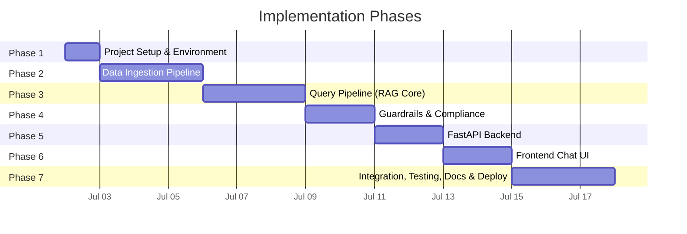
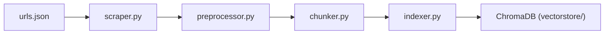
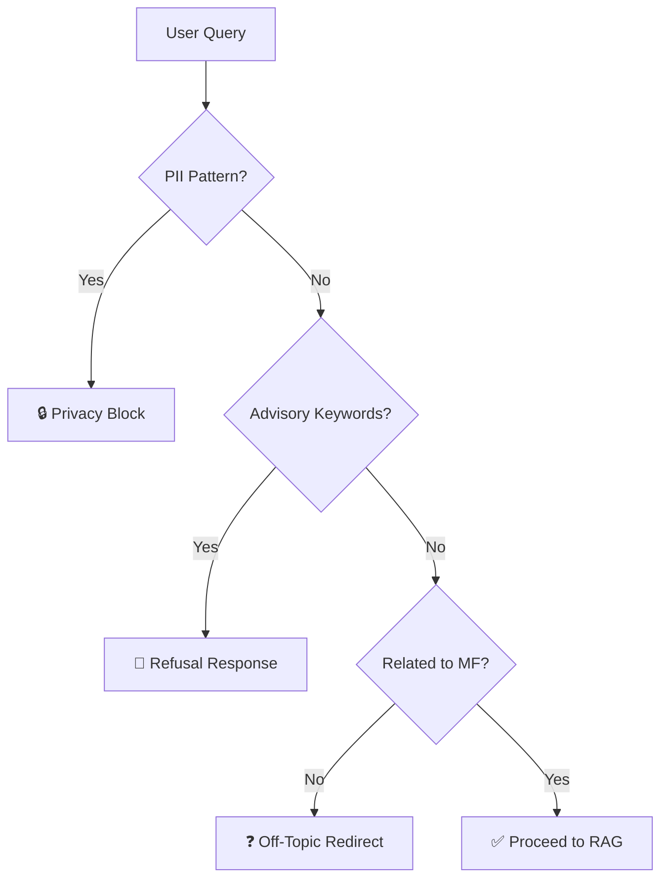
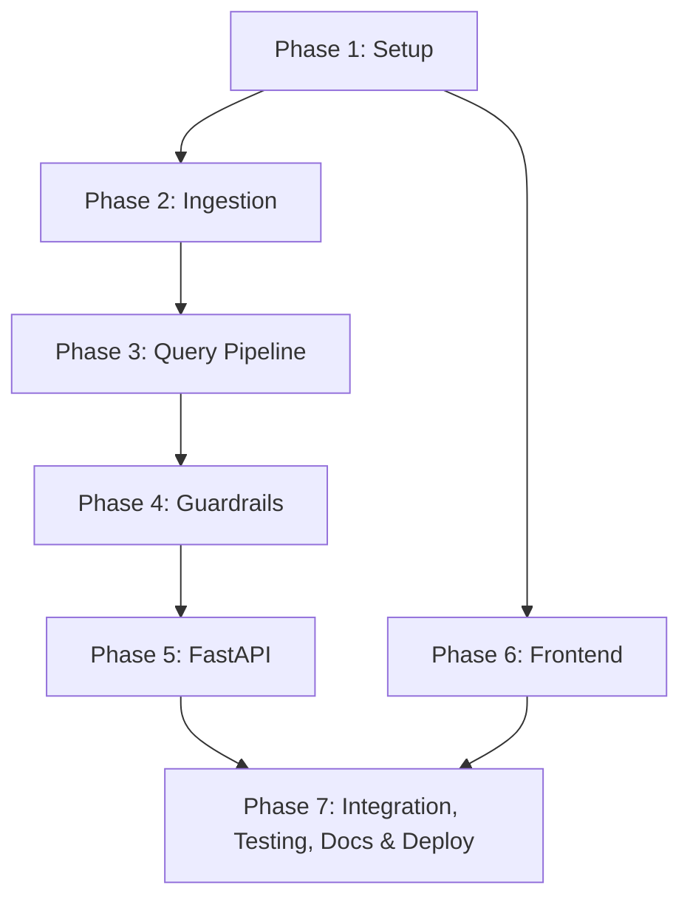

# Implementation Plan: Mutual Fund FAQ Assistant (RAG Chatbot)

> Based on [architecture.md](file:///c:/Users/tanis/rag%20chatbot%20NextLeap/docs/architecture.md) and [context.md](file:///c:/Users/tanis/rag%20chatbot%20NextLeap/docs/context.md)

---

## Phase Overview



| Phase | Name | Duration | Key Deliverables |
|-------|------|----------|------------------|
| 1 | Project Setup & Environment | 1 day | Repo structure, dependencies, config |
| 2 | Data Ingestion Pipeline | 3 days | Scraper, preprocessor, chunker, indexer |
| 3 | Query Pipeline (RAG Core) | 3 days | Retriever, Groq LLM generator, prompt engineering |
| 4 | Guardrails & Compliance | 2 days | Classifier, refusal handler, formatter |
| 5 | FastAPI Backend | 2 days | API routes, schemas, integration |
| 6 | Frontend Chat UI | 2 days | Chat interface, styling, interactivity |
| 7 | Integration, Testing, Documentation & Deployment | 3 days | E2E testing, README, final polish, deployment |

**Total Estimated Duration: ~16 days**

> [!NOTE]
> **LLM Provider:** Groq (`llama-3.3-70b-versatile`) — ultra-fast inference with free tier.
> **Embedding Model:** `BAAI/bge-small-en-v1.5` — open-source, runs locally, strong retrieval performance.

---

## Phase 1: Project Setup & Environment

### Objective
Scaffold the project directory, set up the Python virtual environment, install all dependencies, and configure environment variables.

### Tasks

| # | Task | File(s) | Details |
|---|------|---------|---------|
| 1.1 | Create project directory structure | All directories | Follow the structure defined in [architecture.md §6](file:///c:/Users/tanis/rag%20chatbot%20NextLeap/docs/architecture.md#L293-L336) |
| 1.2 | Initialize Python virtual environment | `venv/` | `python -m venv venv` |
| 1.3 | Create `requirements.txt` | `requirements.txt` | See dependency list below |
| 1.4 | Create `.env.example` and `.env` | `.env`, `.env.example` | API keys for LLM and embedding model |
| 1.5 | Create `.gitignore` | `.gitignore` | Exclude `venv/`, `vectorstore/`, `.env`, `__pycache__/` |
| 1.6 | Create `src/config.py` | `src/config.py` | Centralized config loading from `.env` |
| 1.7 | Create `data/urls.json` | `data/urls.json` | Register all 8 Groww URLs with scheme metadata |
| 1.8 | Initialize git repository | `.git/` | `git init` + initial commit |

### Dependencies (`requirements.txt`)

```
# Core
fastapi==0.115.*
uvicorn[standard]==0.30.*
python-dotenv==1.1.*

# RAG Pipeline
langchain==0.3.*
langchain-community==0.3.*
langchain-groq==0.3.*
chromadb==0.6.*
sentence-transformers==3.*

# LLM Provider
groq==0.15.*

# Web Scraping
beautifulsoup4==4.13.*
requests==2.*

# Utilities
pydantic==2.*
```

### `data/urls.json` Schema

```json
{
  "corpus": [
    {
      "scheme_name": "ICICI Prudential Large Cap Fund",
      "category": "Large Cap",
      "url": "https://groww.in/mutual-funds/icici-prudential-large-cap-fund-direct-growth",
      "plan": "Direct Growth"
    }
  ]
}
```

### Exit Criteria
- [ ] All directories exist as per architecture
- [ ] `pip install -r requirements.txt` completes without errors
- [ ] `config.py` loads `.env` variables successfully
- [ ] `urls.json` contains all 8 scheme entries

---

## Phase 2: Data Ingestion Pipeline

### Objective
Build the offline pipeline that scrapes the 8 Groww URLs, cleans the HTML, splits content into chunks, generates embeddings, and indexes them in ChromaDB.

### Architecture Reference
- [§3.1 Data Ingestion Pipeline](file:///c:/Users/tanis/rag%20chatbot%20NextLeap/docs/architecture.md#L67-L132)
- [§7.1 Ingestion Flow](file:///c:/Users/tanis/rag%20chatbot%20NextLeap/docs/architecture.md#L342-L360)



### Tasks

| # | Task | File | Details |
|---|------|------|---------|
| 2.1 | Build web scraper | `src/ingestion/scraper.py` | Fetch HTML from 8 Groww URLs using `requests` + `BeautifulSoup4`. Extract text content, save raw files to `data/raw/`. Attach metadata: `source_url`, `scheme_name`, `scrape_date`. |
| 2.2 | Build document preprocessor | `src/ingestion/preprocessor.py` | Strip navigation, headers, footers, ads. Normalize whitespace. Extract structured sections (Expense Ratio, Exit Load, SIP details, etc.). Save to `data/processed/`. |
| 2.3 | Build text chunker | `src/ingestion/chunker.py` | Create a structured "Golden Chunk" combining all key-value pairs (Expense ratio, Exit load, etc.). Pass remaining text through LangChain `RecursiveCharacterTextSplitter` (size: ~500, overlap: ~50). Preserve metadata (`source_url`, `scheme_name`) on all chunks. |
| 2.4 | Build indexer | `src/ingestion/indexer.py` | Load chunks → embed using `BAAI/bge-small-en-v1.5` → store in ChromaDB collection `icici_prudential_mf_corpus`. Persist to `vectorstore/`. |
| 2.5 | Create ingestion runner | `src/ingestion/__init__.py` | CLI entry point: `python -m src.ingestion.indexer` to run full pipeline end-to-end. |
| 2.6 | Validate ingestion output | Manual | Verify chunk count, metadata integrity, and sample similarity searches. |

### Key Decisions

| Decision | Choice | Rationale |
|----------|--------|-----------|
| Chunk size | ~500 tokens | Balances context richness with retrieval precision for short factual content |
| Chunk overlap | ~50 tokens | Prevents splitting mid-sentence at boundaries |
| Embedding model | `BAAI/bge-small-en-v1.5` | Open-source, 384-dim, top-tier retrieval on MTEB benchmarks |
| Vector store | ChromaDB (local) | Zero infrastructure, file-persisted, good for prototype |

### Exit Criteria
- [ ] All 8 URLs are scraped successfully
- [ ] Raw HTML saved to `data/raw/` with metadata
- [ ] Cleaned text saved to `data/processed/`
- [ ] Chunks generated with correct metadata
- [ ] ChromaDB collection populated and persisted
- [ ] Sample query `"expense ratio large cap"` returns relevant chunks

---

## Phase 3: Query Pipeline (RAG Core)

### Objective
Build the core RAG query pipeline: embed user queries, retrieve relevant chunks from ChromaDB, assemble context, and generate factual responses using an LLM.

### Architecture Reference
- [§3.2 Query Pipeline](file:///c:/Users/tanis/rag%20chatbot%20NextLeap/docs/architecture.md#L136-L237)
- [§7.2 Query Flow](file:///c:/Users/tanis/rag%20chatbot%20NextLeap/docs/architecture.md#L362-L393)

### Tasks

| # | Task | File | Details |
|---|------|------|---------|
| 3.1 | Build retriever | `src/query/retriever.py` | Embed user query → cosine similarity search in ChromaDB → return top 3–5 chunks with metadata. Support optional scheme-name metadata filtering. |
| 3.2 | Design system prompt | `src/query/generator.py` | Implement the system prompt template from [§3.2.3](file:///c:/Users/tanis/rag%20chatbot%20NextLeap/docs/architecture.md#L174-L198). Enforce all 8 rules (facts-only, 3 sentences, 1 citation, etc.). |
| 3.3 | Build LLM generator | `src/query/generator.py` | Send system prompt + retrieved context + user query to Groq (`llama-3.3-70b-versatile`). Use temperature `0.0`, max tokens `200`. |
| 3.4 | Build end-to-end RAG chain | `src/query/` | Wire retriever → context assembly → LLM generation into a single callable function. |
| 3.5 | Test with sample queries | Manual | Test factual queries like "What is the exit load for Flexicap Fund?" and verify response quality, citation accuracy, and brevity. |

### System Prompt (from architecture)

```
You are a facts-only mutual fund FAQ assistant for ICICI Prudential schemes.

RULES:
1. Answer ONLY using the provided context. Do NOT use external knowledge.
2. Limit responses to a MAXIMUM of 3 sentences.
3. Include EXACTLY ONE source citation link in your response.
4. End every response with: "Last updated from sources: <date>"
5. NEVER provide investment advice, opinions, or recommendations.
6. NEVER compare fund performance or calculate returns.
7. If the question is advisory, refuse politely and provide an educational link.
8. If the answer is not in the context, say "I don't have this information in my sources."

CONTEXT:
{retrieved_chunks}

USER QUESTION:
{user_query}
```

### Exit Criteria
- [ ] Retriever returns relevant chunks for scheme-specific queries
- [ ] LLM generates ≤ 3 sentence responses
- [ ] Each response contains exactly 1 citation link
- [ ] "Last updated" footer is present
- [ ] Responses are factually grounded in retrieved context

---

## Phase 4: Guardrails & Compliance

### Objective
Build the safety layer: query classification (factual vs. advisory vs. PII), refusal handling, and response post-processing validation.

### Architecture Reference
- [§3.2.1 Query Classifier](file:///c:/Users/tanis/rag%20chatbot%20NextLeap/docs/architecture.md#L138-L162)
- [§3.2.5 Refusal Handler](file:///c:/Users/tanis/rag%20chatbot%20NextLeap/docs/architecture.md#L210-L217)
- [§3.2.6 Response Formatter](file:///c:/Users/tanis/rag%20chatbot%20NextLeap/docs/architecture.md#L219-L237)
- [§9 Guardrails & Compliance](file:///c:/Users/tanis/rag%20chatbot%20NextLeap/docs/architecture.md#L440-L465)

### Tasks

| # | Task | File | Details |
|---|------|------|---------|
| 4.1 | Build query classifier | `src/query/classifier.py` | Classify queries into `FACTUAL`, `ADVISORY`, `OFF_TOPIC`, `PII_DETECTED`. Use keyword matching for advisory patterns ("should I", "recommend", "which is better", "compare", "vs") and regex for PII (PAN, Aadhaar, phone, email). |
| 4.2 | Build refusal handler | `src/query/refusal.py` | Generate polite refusal responses for each category. Include educational links (AMFI, SEBI) for advisory queries. Include privacy warning for PII queries. |
| 4.3 | Build response formatter | `src/query/formatter.py` | Post-process every LLM response: validate ≤ 3 sentences, ensure exactly 1 citation, append "Last updated" footer, strip advisory language, validate URL against known corpus. |
| 4.4 | Write classifier tests | `tests/test_classifier.py` | Test advisory detection, PII detection, factual pass-through. |
| 4.5 | Write refusal tests | `tests/test_refusal.py` | Test each refusal category produces correct response template. |
| 4.6 | Write formatter tests | `tests/test_formatter.py` | Test sentence count validation, citation validation, footer injection. |

### Classification Logic



### Refusal Templates

| Category | Response Template |
|----------|-------------------|
| `ADVISORY` | "I'm a facts-only assistant and cannot provide investment advice. For guidance, visit [AMFI](https://www.amfiindia.com/) or consult a SEBI-registered advisor." |
| `PII_DETECTED` | "For your security, please do not share personal information like PAN, Aadhaar, or account numbers here." |
| `OFF_TOPIC` | "I can only answer factual questions about ICICI Prudential mutual fund schemes." |

### Exit Criteria
- [ ] "Should I invest in this fund?" → returns advisory refusal
- [ ] PAN number in query → returns privacy warning
- [ ] "What's the weather?" → returns off-topic redirect
- [ ] Factual queries pass through to RAG pipeline
- [ ] All formatter validations pass on LLM output
- [ ] All unit tests pass

---

## Phase 5: FastAPI Backend

### Objective
Expose the RAG pipeline as a REST API with proper request/response schemas, error handling, and CORS support for the frontend.

### Architecture Reference
- [§8 API Design](file:///c:/Users/tanis/rag%20chatbot%20NextLeap/docs/architecture.md#L397-L436)
- [§6 Project Structure – API module](file:///c:/Users/tanis/rag%20chatbot%20NextLeap/docs/architecture.md#L317-L321)

### Tasks

| # | Task | File | Details |
|---|------|------|---------|
| 5.1 | Define Pydantic schemas | `src/api/models.py` | `ChatRequest(query: str)`, `ChatResponse(answer, source_url, last_updated, type)` |
| 5.2 | Create API routes | `src/api/routes.py` | `POST /api/chat` — main query endpoint. `GET /api/health` — health check. `GET /api/schemes` — list available schemes. |
| 5.3 | Create FastAPI app | `src/api/main.py` | Initialize FastAPI app, configure CORS middleware, mount static files for frontend, include router. |
| 5.4 | Wire routes to pipeline | `src/api/routes.py` | `/api/chat` → classifier → (retriever → generator → formatter) or refusal handler → response. |
| 5.5 | Add error handling | `src/api/main.py` | Global exception handler, input validation errors, LLM API errors. |
| 5.6 | Test API manually | Manual | Use `curl` or Postman to test all 3 endpoints. |

### API Schema Summary

```
POST /api/chat
├── Request:  { "query": "string" }
└── Response: { "answer": "string", "source_url": "string", "last_updated": "YYYY-MM-DD", "type": "factual|refusal" }

GET /api/health
└── Response: { "status": "ok" }

GET /api/schemes
└── Response: { "schemes": ["ICICI Prudential Large Cap Fund", ...] }
```

### Exit Criteria
- [ ] `POST /api/chat` returns valid JSON for factual queries
- [ ] `POST /api/chat` returns refusal JSON for advisory queries
- [ ] `GET /api/health` returns `200 OK`
- [ ] `GET /api/schemes` returns all 8 scheme names
- [ ] CORS enabled for frontend origin
- [ ] Input validation rejects empty/invalid queries

---

## Phase 6: Frontend Chat UI

### Objective
Build a clean, minimal, Groww-inspired chat interface with a welcome screen, example questions, disclaimer, and real-time chat functionality.

### Architecture Reference
- [§4 Frontend Architecture](file:///c:/Users/tanis/rag%20chatbot%20NextLeap/docs/architecture.md#L241-L277)

### Tasks

| # | Task | File | Details |
|---|------|------|---------|
| 6.1 | Create HTML structure | `frontend/index.html` | Header with title + disclaimer, welcome screen with 3 example questions, chat message area, input bar with send button. |
| 6.2 | Style the interface | `frontend/style.css` | Clean, minimal design. Groww-inspired color palette (greens, whites, subtle grays). Chat bubbles: user (right, accent color) and bot (left, light background). Source badges below bot responses. Typing indicator animation. Responsive layout. |
| 6.3 | Implement chat logic | `frontend/app.js` | Send queries to `POST /api/chat`. Render bot responses with answer + clickable source link + "Last updated" footer. Handle loading states. Handle example question clicks. Auto-scroll to latest message. |
| 6.4 | Add disclaimer banner | `frontend/index.html` | Persistent banner: `"Facts-only. No investment advice."` |
| 6.5 | Serve static files | `src/api/main.py` | Mount `frontend/` directory as static files in FastAPI. |
| 6.6 | Cross-browser testing | Manual | Test in Chrome, Firefox, Edge. Verify responsiveness. |

### UI Wireframe

```
┌──────────────────────────────────────────────┐
│  🏦 Mutual Fund FAQ Assistant                │
│  ⚠️ Facts-only. No investment advice.        │
├──────────────────────────────────────────────┤
│                                              │
│  Welcome! I can answer factual questions     │
│  about ICICI Prudential mutual fund schemes. │
│                                              │
│  Try asking:                                 │
│  ┌──────────────────────────────────────┐    │
│  │ What is the expense ratio of ICICI   │    │
│  │ Prudential Large Cap Fund?           │    │
│  └──────────────────────────────────────┘    │
│  ┌──────────────────────────────────────┐    │
│  │ What is the exit load for ICICI      │    │
│  │ Prudential Flexicap Fund?            │    │
│  └──────────────────────────────────────┘    │
│  ┌──────────────────────────────────────┐    │
│  │ What is the minimum SIP amount for   │    │
│  │ ICICI Prudential Technology Fund?    │    │
│  └──────────────────────────────────────┘    │
│                                              │
│  ┌────── Chat Messages ──────────────┐       │
│  │                                    │       │
│  │  [User]: What is the exit load?    │       │
│  │                                    │       │
│  │  [Bot]: The exit load for ...      │       │
│  │  📎 Source: groww.in/...           │       │
│  │  🕐 Last updated: 2026-07-01      │       │
│  │                                    │       │
│  └────────────────────────────────────┘       │
│                                              │
│  ┌─────────────────────────────┐ [Send]      │
│  │ Ask a question...           │             │
│  └─────────────────────────────┘             │
└──────────────────────────────────────────────┘
```

### Exit Criteria
- [ ] Welcome screen displays with 3 clickable example questions
- [ ] Disclaimer banner is visible at all times
- [ ] User can type and send queries
- [ ] Bot responses display with answer, source link, and date
- [ ] Typing indicator shows while waiting for API
- [ ] UI is clean, responsive, and visually polished

---

## Phase 7: Integration, Testing, Documentation & Deployment

### Objective
End-to-end integration testing, edge case validation, bug fixing, documentation, and deployment preparation across the full stack.

### Tasks

| # | Task | Details |
|---|------|---------|
| 7.1 | End-to-end flow test | User types query → API processes → RAG retrieves → Groq LLM generates → formatted response displays in chat UI. Test all 8 schemes. |
| 7.2 | Factual query test suite | Test at least 2 factual queries per scheme (16 total). Verify accuracy, citations, and brevity. |
| 7.3 | Refusal test suite | Test advisory queries ("Should I invest?", "Which is better?", "Recommend a fund"). Verify polite refusal + educational link. |
| 7.4 | PII detection test | Test with sample PAN, Aadhaar, phone, email in query. Verify privacy block. |
| 7.5 | Edge case tests | Empty query, very long query (>500 chars), special characters, queries about non-existent schemes. |
| 7.6 | Response format validation | Verify every response: ≤ 3 sentences, 1 citation, "Last updated" footer. |
| 7.7 | Performance check | Measure average response time. Target: < 5 seconds end-to-end (Groq inference is ultra-fast). |
| 7.8 | Bug fixes | Fix any issues discovered during testing. |
| 7.9 | Write README | `README.md` — project overview, setup instructions, selected AMC/schemes, architecture summary, how to run, known limitations, disclaimer. |
| 7.10 | Create `.env.example` | Template with placeholder `GROQ_API_KEY`. |
| 7.11 | Final code cleanup | Remove debug logs, add docstrings, consistent formatting across all `src/` files. |
| 7.12 | Verify deployment steps | Follow README from scratch on a clean environment to confirm setup works. |
| 7.13 | Final git commit & tag | Tag as `v1.0.0`. |

### Test Matrix

| Query Type | Example | Expected Behavior |
|------------|---------|-------------------|
| Factual (specific scheme) | "Expense ratio of Large Cap Fund" | Answer + source URL + date |
| Factual (general) | "What is a SIP?" | Answer from context if available, else "I don't have this information" |
| Advisory | "Should I invest in Technology Fund?" | Polite refusal + AMFI link |
| Comparative | "Large Cap vs Flexicap" | Refusal (no comparisons) |
| PII | "My PAN is ABCDE1234F" | Privacy warning |
| Off-topic | "What's the weather today?" | Off-topic redirect |
| Empty | "" | Prompt to ask a question |
| Long query | 500+ character string | Truncate or reject |

### README Structure

```markdown
# Mutual Fund FAQ Assistant

## Overview
## Disclaimer
## Selected AMC & Schemes
## Architecture (RAG Approach)
## Tech Stack
## Setup Instructions
## Usage
## API Endpoints
## Known Limitations
## License
```

### Exit Criteria
- [ ] All 16 scheme-specific factual queries return accurate answers
- [ ] All refusal scenarios handled correctly
- [ ] All edge cases handled gracefully
- [ ] Average response time < 5 seconds
- [ ] No unhandled errors in the full flow
- [ ] All unit tests pass (`pytest tests/`)
- [ ] README is complete and accurate
- [ ] Clean environment setup works end-to-end
- [ ] All code has docstrings
- [ ] Disclaimer present in README and UI
- [ ] Repository tagged `v1.0.0`

---

## Risk Register

| Risk | Impact | Probability | Mitigation |
|------|--------|-------------|------------|
| Groww blocks scraping requests | **High** — no data | Medium | Use proper headers, rate limiting; cache scraped data locally |
| Groww page structure changes | **Medium** — broken parsing | Medium | Use resilient CSS selectors; add scraper validation |
| LLM generates advisory content | **High** — compliance violation | Low | Strict system prompt + output guardrails + validation |
| Groq API rate limits exceeded | **Medium** — service downtime | Low | Groq free tier has generous limits; add retry with backoff |
| ChromaDB performance at scale | **Low** — slow retrieval | Low | Only 8 schemes; not a concern at this scale |

---

## Dependency Map



> [!NOTE]
> **Phase 6 (Frontend)** can be developed in parallel with Phases 3–5 since it only depends on the API contract (defined in Phase 1). However, integration testing in Phase 7 requires all phases to be complete.
